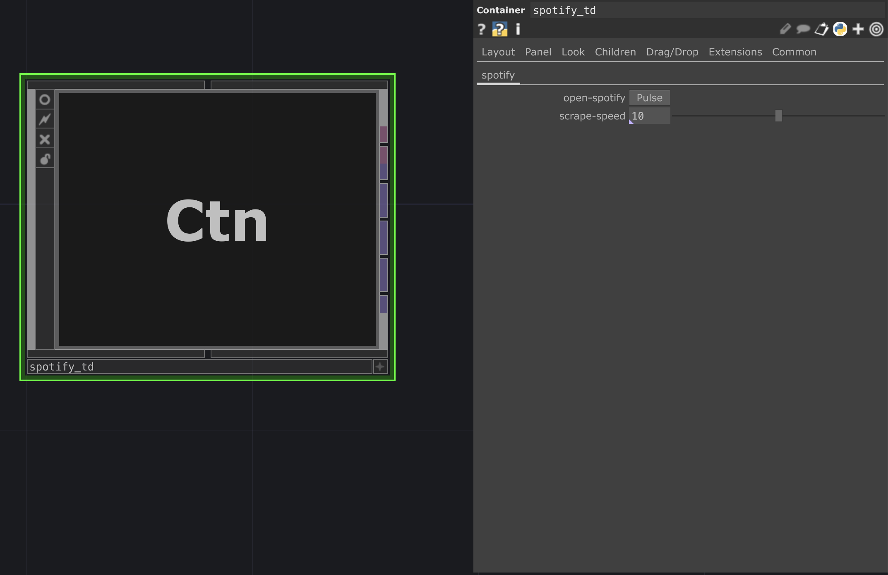
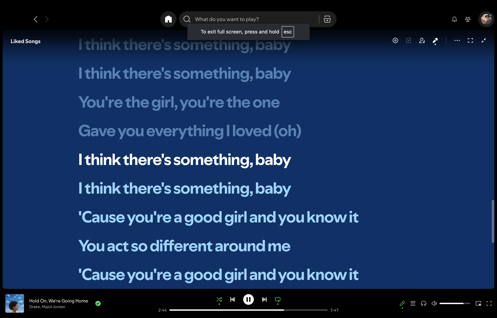
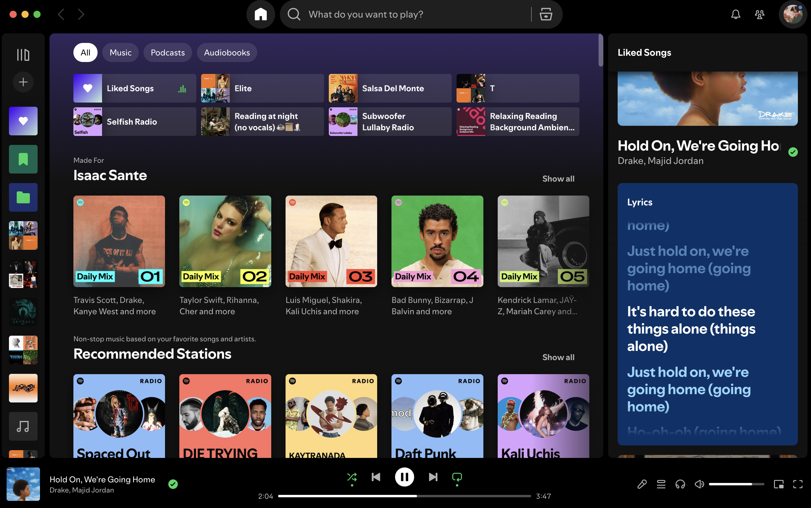

# spotify-td

* Currently working and tested on MACOS. Still working on windows OS.
* This project uses your own desktop app and spotify account. Commercializing something like this is not advisable, unless you want to fight the spotify lawyers.

## Instructions
Import TOX file into your TD project.
Hit the open spotify pulse button to get the websocket connection started.

This only works for song with lyrics. 
You can have the desktop app window in the background and control songs from the phone app for the best experience. 

On the spotify desktop app enable the full screen lyrics.

Or have them be visible in the side bar.

